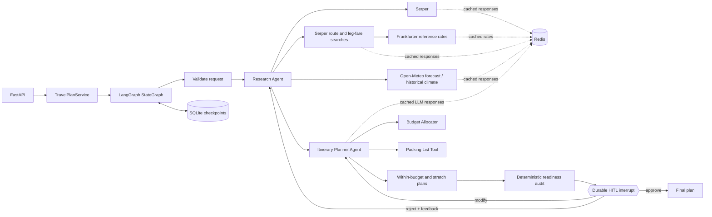

# AI Travel Planner

A complete take-home implementation of a multi-agent travel planning service built with
Python, LangGraph, and FastAPI. A research agent gathers destination intelligence, an itinerary
agent creates a budget-aware day-by-day plan, and the workflow pauses durably until a person
approves, rejects, or modifies the draft.

The service runs without paid credentials in `demo` mode. In `live` mode it uses Serper for
current web research, Open-Meteo for live forecasts or historical climate context, and optionally
the OpenAI Responses API for schema-constrained research synthesis and itinerary generation.
If an OpenAI call fails or exceeds its configured timeout, the validated deterministic generator
completes the plan instead of failing the whole request.

## Architecture



Every plan ID is also a LangGraph `thread_id`. LangGraph checkpoints the state in SQLite before
the review interrupt, so a plan can be resumed after an application restart. The API does not
expose a final plan until the approval branch has completed.

## Features

- FastAPI endpoints for creation, status, HITL review, and final retrieval
- Real LangGraph `interrupt()` and `Command(resume=...)` lifecycle
- SQLite-backed checkpoint persistence across process restarts
- Separate research and itinerary agents with two tools each
- Serper search with normalized source records
- Agent-selected direct or connected round-trip transport options with explicit per-leg pricing
- Economy-only fare filtering by default, with an opt-in flag for labelled premium cabins
- Complete transport totals in the budget currency and an estimated destination-currency total
- A recommended within-budget plan and an optional stretch plan capped at 15% over budget
- A weighted, explainable readiness audit before human approval
- Open-Meteo live forecasts and five-year same-date climate estimates without an API key
- Optional OpenAI schema-constrained generation
- Redis caching for successful Serper, Open-Meteo, Frankfurter, and identical OpenAI requests
- Credential-free, deterministic demo mode for local evaluation
- Approve, reject-with-feedback, and targeted modification paths
- Strict input and generated-plan validation, meaningful 404/409/422/502 responses, and revision
  limits
- Docker support and an executable API demo script

## Quick start

### 1. Create a virtual environment

Python 3.11 through 3.13 is supported.

```bash
cd ai-travel-planner
python3.12 -m venv .venv
source .venv/bin/activate
python -m pip install -e .
```

Install the optional development dependency when you want to run Ruff:

```bash
python -m pip install -e '.[dev]'
```

### 2. Configure the application

Demo mode needs no secrets:

```bash
cp .env.example .env
```

The example enables Redis caching. Start Redis with Docker before running the API:

```bash
docker compose up -d redis
```

If Redis is not available, clear `REDIS_URL`; provider calls will continue without caching.

To use current web research, set `APP_MODE=live` and configure Serper:

```dotenv
APP_MODE=live
SERPER_API_KEY=your_serper_key
```

LLM generation is optional. The agent/tool workflow still runs deterministically without it. To
enable OpenAI:

```dotenv
LLM_PROVIDER=openai
OPENAI_API_KEY=your_openai_key
OPENAI_MODEL=gpt-5-mini
```

### 3. Run the API

```bash
uvicorn app.main:app --reload
```

Open:

- Swagger UI: <http://127.0.0.1:8000/docs>
- OpenAPI JSON: <http://127.0.0.1:8000/openapi.json>
- Health check: <http://127.0.0.1:8000/health>

Swagger's `POST /plan` operation includes a connected Bangalore-to-Kyoto example and a direct
London-to-Paris example. Select an example before using **Try it out**.

## API workflow

### Create a plan

```bash
curl -sS -X POST http://127.0.0.1:8000/plan \
  -H 'Content-Type: application/json' \
  -d '{
    "current_location": "Bengaluru, India",
    "destination": "Kyoto, Japan",
    "start_date": "2026-11-10",
    "end_date": "2026-11-12",
    "budget_min": 1800,
    "budget_max": 2600,
    "currency": "USD",
    "interests": ["temples", "food", "photography"],
    "travelers": 2,
    "preferences": ["vegetarian-friendly", "public transport"],
    "transport_modes": ["flight", "train", "bus"],
    "allow_transport_connections": true,
    "include_premium_fares": false
  }'
```

The call executes research and planning synchronously, stops at the durable review interrupt, and
returns HTTP `201` with a `plan_id`, status URL, and review URL.

The user supplies only the complete trip budget range. The agent discovers transport prices and
selects the cheapest verified option instead of asking the user to estimate a separate transport
budget. The selected transport cost is deducted before the remaining amount is allocated across
lodging (35%), food (20%), activities (25%), local transport (15%), and contingency (5%).
The budget response is explicitly labelled `spending_allocation_not_booking_quote`: destination
categories are spending limits, not claims that real products were found at those prices.

`transport_modes` controls which travel modes may be recommended. It accepts `flight`, `train`,
`bus`, `ferry`, and `car`. `allow_transport_connections` lets the tool use a major gateway when the
destination has no suitable airport or direct result. Both fields have permissive defaults, so they
may be omitted.

`include_premium_fares` defaults to `false`. In that mode, flight prices explicitly labelled as
premium economy, business class, or first class are rejected. Set it to `true` to include those
options alongside economy results. Every accepted flight fare carries a `cabin_class` value so an
expensive premium ticket cannot be presented as an unexplained general fare.

In live mode, a result must match the route, identify a permitted mode, contain an explicit price,
and state whether that price is round trip or one way. An explicit one-way amount may be doubled and
labelled; a directionally ambiguous starting price is rejected. The matcher recognizes common city
and airport aliases such as Bangalore, Bengaluru, and BLR. Foreign-currency fares are accepted only
when they can be converted into the request currency. Social-media sources, unrelated card/pass
amounts, and premium-cabin fares that were not requested are rejected. If the snippet does not
explicitly say the fare is per person, the option is retained with `fare_basis` set to
`assumed_per_person`, and the assumption is repeated in the plan. When no direct result qualifies
and connections are allowed, the service can return a flight to Tokyo followed by a train to Kyoto.

Fare snippets with dates that conflict with the request are rejected. `fare_date_basis` is
`exact_dates` when both requested dates appear, `partial_dates` when only part of the requested
range appears, and `dates_not_shown` when the search used the dates but the result snippet does not
display them. A connected route is also marked with `connection_schedule_status: not_verified`
because separately sourced flight and ground fares do not prove that their arrival and departure
times form a safe connection.

A transport option contains `fare_basis`, `round_trip_basis`, `price_scope`, `priced_legs`, and
`unpriced_legs`. Every flight, train, bus, ferry, or car segment is shown separately. A priced leg
identifies its origin, destination, mode, native fare and currency, traveler count, and converted
leg total in the request's budget currency. A leg without reliable fare evidence appears under
`unpriced_legs` with `pricing_status: price_unavailable` and a reason.

`priced_cost_per_person` and `priced_total_cost` include only `priced_legs`. If both the
Bengaluru-to-Tokyo flight and Tokyo-to-Kyoto train have acceptable fare evidence, they appear as
two separate priced legs and their converted values are added. When a result only contains a
starting fare, the service doubles it and sets `round_trip_basis` to `one_way_doubled`.

If an onward fare cannot be sourced or converted, `price_scope` remains `primary_leg_only`; the
connection appears under `unpriced_legs` and its price is not invented. In that case,
`priced_total_cost` is explicitly only a subtotal. If all required legs are priced, `price_scope`
is `complete_route` and the sum of `priced_legs` is validated against `priced_total_cost`. The last
transport field, `priced_total_in_destination_currency`, converts that same priced amount into the
destination currency, such as JPY for Japan or USD for the United States. It includes the reference
exchange rate and rate date. Conversion uses
[Frankfurter's no-key reference-rate API](https://frankfurter.dev/) and fails open, so a temporary
rate-service problem omits only the conversion instead of failing the plan. If neither a direct nor
connected sourced result qualifies, `transport_options` is empty and no budget scenario is offered.

The within-budget scenario targets the midpoint of `budget_min` and `budget_max`, moving up to the
maximum only when the selected transport requires it. It never exceeds `budget_max`. The stretch
scenario uses the same cheapest transport and a total capped at 15% above `budget_max`, allocating
more money across the destination categories. Its `over_budget_by` field makes the difference
explicit.

Weather uses a live forecast when the departure is within 15 days. For dates farther away, the
service retrieves Open-Meteo ERA5 data for the same travel dates across the previous five years and
returns average high, low, and daily precipitation values as
`historical_climate_estimate`. If weather services are unavailable, it falls back to
`generic_seasonal_guidance` without inventing measurements.

### Inspect the draft and workflow status

```bash
curl -sS http://127.0.0.1:8000/plan/PLAN_ID
```

The response includes the validated request, research report, sorted transport options,
`draft_plan` for the within-budget scenario, `stretch_plan`, their readiness evaluations, review
history, revision count, and `awaiting_input`. Before approval, the status is `awaiting_review`.

`draft_readiness` and `stretch_readiness` contain a score out of 100 and ten weighted checks for
date coverage, budget compliance, activity spending, route completeness, fare dates, connection
schedules, fare evidence, weather confidence, activity sources, and preference coverage. A check
is `pass`, `warning`, or `blocker`. Warnings produce `needs_verification` and remain approvable;
blockers produce `blocked` and remove that scenario from `available_plan_choices`. The same audit
is included in `awaiting_input.readiness`, so the reviewer sees the reasons before deciding.

### Approve

Approval defaults to the within-budget plan:

```bash
curl -sS -X POST http://127.0.0.1:8000/plan/PLAN_ID/review \
  -H 'Content-Type: application/json' \
  -d '{"action":"approve","feedback":"Ready to finalize."}'
```

To approve the optional stretch plan instead:

```bash
curl -sS -X POST http://127.0.0.1:8000/plan/PLAN_ID/review \
  -H 'Content-Type: application/json' \
  -d '{"action":"approve","plan_choice":"stretch"}'
```

### Reject with feedback

Rejection routes back through research and itinerary generation, then pauses on a new review.

```bash
curl -sS -X POST http://127.0.0.1:8000/plan/PLAN_ID/review \
  -H 'Content-Type: application/json' \
  -d '{
    "action":"reject",
    "feedback":"Add stronger late-evening transit safety research."
  }'
```

### Modify selected plan details

Modification routes directly back to the itinerary agent and supports hotel and per-day changes.
Each referenced day must exist in the trip, and duplicate or blank changes are rejected.

```bash
curl -sS -X POST http://127.0.0.1:8000/plan/PLAN_ID/review \
  -H 'Content-Type: application/json' \
  -d '{
    "action":"modify",
    "feedback":"Make day two slower.",
    "modifications": {
      "hotel_preference":"Prefer a quiet hotel near Kyoto Station.",
      "day_changes":[{
        "day":2,
        "replace_activities_with":["Tea ceremony","Riverside walk"],
        "note":"Keep the afternoon low-key."
      }]
    }
  }'
```

### Review rules

- `approve` accepts optional feedback and an optional `plan_choice` of `within_budget` or
  `stretch`; omitting it selects `within_budget`.
- `reject` requires feedback and must not include `modifications`.
- `modify` requires a `modifications` object containing a hotel preference, day changes, or both.
- `plan_choice` is rejected for `reject` and `modify` actions.
- A scenario can be approved only when it is available in the current plan response.
- A scenario with an unresolved readiness blocker cannot be approved; warnings require review but
  do not prevent approval.
- A review is accepted only while the plan is `awaiting_review`. Approval finalizes and freezes the
  plan; create a new plan if changes are needed afterward.

Swagger UI provides separate within-budget approval, stretch approval, rejection, and modification
examples. Choose the matching example before submitting the review request.

### Retrieve the final plan

```bash
curl -sS http://127.0.0.1:8000/plan/PLAN_ID/final
```

This endpoint returns HTTP `409` until a scenario is approved. After approval it returns only the
selected frozen itinerary, including its `scenario`, requested budget range, `over_budget_by`,
selected transport, budget, packing list, assumptions, plan ID, and finalization timestamp.

## Endpoints

| Method | Endpoint | Result |
|---|---|---|
| `GET` | `/health` | Liveness and configured mode |
| `POST` | `/plan` | Create a plan and execute through the first review pause |
| `GET` | `/plan/{id}` | Current checkpointed state and draft |
| `POST` | `/plan/{id}/review` | Resume with approve, reject, or modify |
| `GET` | `/plan/{id}/final` | Finalized plan after approval only |

## Configuration

| Variable | Default | Meaning |
|---|---:|---|
| `APP_MODE` | `demo` | `demo` uses labeled sample data; `live` calls Serper and Open-Meteo |
| `DATABASE_PATH` | `data/travel_planner.sqlite3` | Durable LangGraph SQLite checkpoint file |
| `SERPER_API_KEY` | empty | Serper credential |
| `LLM_PROVIDER` | `deterministic` | `deterministic` or `openai` |
| `OPENAI_API_KEY` | empty | OpenAI credential |
| `OPENAI_MODEL` | `gpt-5-mini` | Responses API model name |
| `OPENAI_TIMEOUT_SECONDS` | `120` | Per-call OpenAI read timeout before deterministic fallback |
| `HTTP_TIMEOUT_SECONDS` | `20` | Timeout for search, weather, and connections |
| `REDIS_URL` | empty | Redis connection URL; for example `redis://localhost:6379/0` |
| `CACHE_TTL_SECONDS` | `900` | Redis lifetime for successful provider responses; `0` disables caching |
| `MAX_REVISIONS` | `5` | Maximum reject/modify cycles; approval remains available |

`APP_MODE=live` fails clearly if the Serper key is unavailable. Open-Meteo forecasts
are used when the requested start date is inside its short forecast window. Later dates use a
five-year historical climate estimate, with generic seasonal guidance as the failure fallback.

Cache entries use hashed keys and contain only successful results. Exact repeated live searches,
weather requests, currency rates, and OpenAI structured-generation requests are reused until the
TTL expires. Redis errors are logged and bypassed, so a cache outage does not fail plan creation.

OpenAI generates only the narrative research fields and day-by-day itinerary content. Search,
weather, transport, currency, budget, and packing outputs are validated and attached by Python
instead of being repeated through the model.

## Check code quality

```bash
ruff check .
```

## Run the demo script

With the API running in another terminal:

```bash
python scripts/demo.py
```

It creates a three-day plan, reads the draft, approves it, and retrieves the final plan.

## Docker

After configuring `.env` as described above:

```bash
docker compose up --build
```

Docker Compose starts the API and Redis together. The `data/` bind mount preserves SQLite
checkpoints, and the `redis-data` volume preserves cached entries until their TTL expires.

## Design decisions and tradeoffs

- **Synchronous plan creation:** `POST /plan` returns only after research/planning reaches review.
  This is simple and deterministic for a take-home. For long provider calls, production should
  return `202 Accepted` and run the graph through a worker queue.
- **SQLite checkpointer:** ideal for local evaluation and proves durable HITL semantics. A
  multi-instance deployment should use PostgreSQL or another supported network checkpointer.
- **Deterministic fallback:** reviewers can exercise every path without keys or API charges. It is
  also used when LLM output fails date, budget, or structural consistency checks. All demo sources
  and estimates are labeled; live claims are not silently fabricated.
- **Redis TTL cache:** exact successful provider responses and exchange rates are shared across app
  processes to reduce latency, rate-limit usage, and LLM cost. Cache access fails open, and hashed
  keys avoid placing raw queries or prompts in Redis key names.
- **Conservative transport matching:** direct routes require an explicit fare in the requested
  route and a clear one-way or round-trip basis. Ambiguous starting fares, unrequested premium
  cabins, social-media sources, and unrelated card/pass prices are discarded. Connected routes
  search the gateway leg in the destination currency, convert it into the budget currency, and add
  it to the primary leg. Implied per-person fares are labelled `assumed_per_person`; explicit
  one-way fares that are doubled are labelled `one_way_doubled`. Missing onward fares remain
  `primary_leg_only` rather than being invented.
- **Two budget scenarios:** the within-budget plan never exceeds the user's maximum. The optional
  stretch plan is capped at 15% above it, clearly reports the difference, and is never selected
  unless the reviewer explicitly chooses it.
- **Explainable readiness audit:** deterministic checks score each scenario before review. The
  score summarizes quality, while individual pass, warning, and blocker messages preserve the
  evidence needed for a human decision. No additional LLM call is used.
- **Allocation rather than live booking validation:** each scenario is labelled as a spending
  allocation and divides its total into usable limits. It does not prove that live hotels, meals,
  or activities are available at those amounts; those prices still need to be verified.
- **Small modification contract:** hotel and per-day edits are auditable and easy to validate.
- **Research on reject, planning on modify:** rejection can invalidate evidence, so it repeats both
  agents. A targeted modification normally preserves research and only reruns planning.
- **No booking side effects:** the system generates planning recommendations only. Activities,
  prices, safety advice, and operating details must be confirmed before purchase.

## Recommended Improvements

### 1. Background processing

Move research and itinerary generation to a background worker. `POST /plan` could return
`202 Accepted` immediately, while `GET /plan/{id}` reports progress. BullMQ could be used with a
separate Node.js worker, or a Python-native queue such as Celery, RQ, or ARQ could be used.

### 2. Production database

Replace local SQLite with PostgreSQL so multiple application instances can safely share workflow
checkpoints and plan data.

### 3. Authentication and ownership

Add token-based authentication and associate every plan with a user. Users should only be able to
read or modify plans that they own.

### 4. External API reliability

Add retries, exponential backoff, rate limiting, and fallback providers for web search, weather,
and LLM calls.

### 5. Prompt validation

Detect and handle personally identifiable information, sanitize input before inserting it into a
prompt or sending it to an LLM, defend against prompt-injection attempts, and add guardrails around
tool selection and execution.

### 6. Research quality and citations

Prioritize official tourism and travel-advisory sources. Store source dates and attach citations to
important claims such as safety guidance, prices, and opening hours.

### 7. Additional travel tools

Replace search-snippet transport estimates with live flight, rail, bus, and ferry availability
APIs. Add hotel availability, restaurant search, and accurate transport times. Replace reference
exchange rates with a booking-time foreign-exchange quote when payment precision is required.

### 8. User interface

Build a small web interface for entering preferences, viewing the itinerary, changing a specific
day, and approving or rejecting a plan without using Swagger UI.

### 9. Monitoring and cost visibility

Add structured logs, distributed tracing, performance metrics, alerts, provider-latency tracking,
LLM token-cost monitoring, cache hit/miss metrics, and cache-stampede protection.

### 10. Safe concurrent review

Add database-backed plan versions and concurrency checks across multiple application instances so
two reviewers cannot accidentally resume or overwrite the same workflow checkpoint.

### 11. Automated testing

Add validation and tool unit tests, endpoint tests, approve/reject/modify workflow tests,
restart-persistence tests, provider contract tests, and load tests.

### 12. Security and privacy

Store credentials in a secrets manager, encrypt sensitive trip information, redact personal data
from logs, and define retention and deletion policies.

### 13. Itinerary quality evaluation

The current readiness evaluator checks date coverage, budget compliance, activity spending,
transport completeness and date evidence, connection status, fare evidence, weather confidence,
activity sources, and basic preference coverage. Extend it with provider-backed opening hours,
activity durations and overlap detection, realistic travel times, accessibility checks, and deeper
preference-satisfaction evaluation.

## Assumptions

- A trip is between 1 and 21 calendar days and has 1-20 travelers.
- `current_location` is the traveler origin used for research and planning context; provide a
  city/region and country rather than a street address.
- `budget_min` and `budget_max` describe the user's complete trip budget; the user does not estimate
  a separate origin transport allocation.
- Accepted transport fares have an explicit round-trip basis or an explicit one-way basis that can
  be doubled. Per-person wording is preferred; any assumption is exposed through `fare_basis`.
  Fares are not live inventory or confirmed quotes.
- Explicit fare dates that conflict with the request are rejected. Missing or partial dates remain
  visible through `fare_date_basis` and require booking-time verification.
- For a connected route, independently sourced leg totals are converted to the request currency
  and added together. If the onward leg cannot be priced, `price_scope` and `connection_note`
  identify that the displayed amount covers only the primary leg.
- Separate connected legs are not schedule-matched; the response marks this and requires transfer,
  immigration, baggage, and delay buffers to be checked before purchase.
- The deterministic demo uses a clearly labeled sample transport estimate so both budget scenarios
  can be evaluated without live credentials.
- Weather beyond the live-forecast window is a five-year historical same-date estimate rather than
  a prediction of the future trip's exact conditions.
- Destination-currency totals use daily reference rates and are informational; card, bank, and
  booking-provider rates and fees can differ. Booking remains outside scope.
- Search results are research inputs rather than guarantees; the plan carries verification notes.
- One reviewer acts on a plan at a time in this local implementation.
