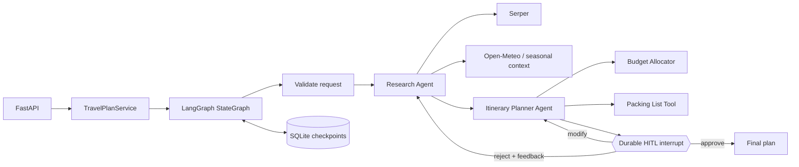

# AI Travel Planner

A complete take-home implementation of a multi-agent travel planning service built with
Python, LangGraph, and FastAPI. A research agent gathers destination intelligence, an itinerary
agent creates a budget-aware day-by-day plan, and the workflow pauses durably until a person
approves, rejects, or modifies the draft.

The service runs without paid credentials in `demo` mode. In `live` mode it uses Serper for
current web research, Open-Meteo for forecast context, and optionally the OpenAI Responses API
for schema-constrained research synthesis and itinerary generation.

## Architecture



Every plan ID is also a LangGraph `thread_id`. LangGraph checkpoints the state in SQLite before
the review interrupt, so a plan can be resumed after an application restart. The API does not
expose a final plan until the approval branch has completed.

## Features

- FastAPI endpoints for creation, status, HITL review, and final retrieval
- Real LangGraph `interrupt()` and `Command(resume=...)` lifecycle
- SQLite-backed checkpoint persistence across process restarts
- Separate research and itinerary agents with two tools each
- Serper search with normalized source records
- Open-Meteo geocoding and forecast context without an API key
- Optional OpenAI schema-constrained generation
- Credential-free, deterministic demo mode for local evaluation
- Approve, reject-with-feedback, and targeted modification paths
- Strict Pydantic validation, meaningful 404/409/422/502 responses, and revision limits
- Docker support and an executable API demo script

## Quick start

### 1. Create a virtual environment

Python 3.11 or 3.12 is supported.

```bash
cd ai-travel-planner
python3.12 -m venv .venv
source .venv/bin/activate
python -m pip install -e '.[dev]'
```

### 2. Configure the application

Demo mode needs no secrets:

```bash
cp .env.example .env
```

To use current web research, set `APP_MODE=live` and configure Serper:

```dotenv
APP_MODE=live
SERPER_API_KEY=your_serper_key
```

LLM generation is optional. The agent/tool workflow still runs deterministically without it. To
enable OpenAI:

```dotenv
LLM_PROVIDER=openai
OPENAI_API_KEY=your_openai_key
OPENAI_MODEL=gpt-5-mini
```

### 3. Run the API

```bash
uvicorn app.main:app --reload
```

Open:

- Swagger UI: <http://127.0.0.1:8000/docs>
- OpenAPI JSON: <http://127.0.0.1:8000/openapi.json>
- Health check: <http://127.0.0.1:8000/health>

## API workflow

### Create a plan

```bash
curl -sS -X POST http://127.0.0.1:8000/plan \
  -H 'Content-Type: application/json' \
  -d '{
    "destination": "Kyoto, Japan",
    "start_date": "2026-11-10",
    "end_date": "2026-11-12",
    "budget_min": 1800,
    "budget_max": 2600,
    "currency": "USD",
    "interests": ["temples", "food", "photography"],
    "travelers": 2,
    "preferences": ["vegetarian-friendly", "public transport"]
  }'
```

The call executes research and planning synchronously, stops at the durable review interrupt, and
returns HTTP `201` with a `plan_id`, status URL, and review URL.

### Inspect the draft and workflow status

```bash
curl -sS http://127.0.0.1:8000/plan/PLAN_ID
```

The response includes the validated request, research report, draft itinerary, review history,
revision count, and `awaiting_input`. Before approval, the status is `awaiting_review`.

### Approve

```bash
curl -sS -X POST http://127.0.0.1:8000/plan/PLAN_ID/review \
  -H 'Content-Type: application/json' \
  -d '{"action":"approve","feedback":"Ready to finalize."}'
```

### Reject with feedback

Rejection routes back through research and itinerary generation, then pauses on a new review.

```bash
curl -sS -X POST http://127.0.0.1:8000/plan/PLAN_ID/review \
  -H 'Content-Type: application/json' \
  -d '{
    "action":"reject",
    "feedback":"Add stronger late-evening transit safety research."
  }'
```

### Modify selected plan details

Modification routes directly back to the itinerary agent and supports hotel and per-day changes.

```bash
curl -sS -X POST http://127.0.0.1:8000/plan/PLAN_ID/review \
  -H 'Content-Type: application/json' \
  -d '{
    "action":"modify",
    "feedback":"Make day two slower.",
    "modifications": {
      "hotel_preference":"Prefer a quiet hotel near Kyoto Station.",
      "day_changes":[{
        "day":2,
        "replace_activities_with":["Tea ceremony","Riverside walk"],
        "note":"Keep the afternoon low-key."
      }]
    }
  }'
```

### Retrieve the final plan

```bash
curl -sS http://127.0.0.1:8000/plan/PLAN_ID/final
```

This endpoint returns HTTP `409` until the plan is approved. After approval it returns the frozen
itinerary, budget, packing list, assumptions, plan ID, and finalization timestamp.

## Endpoints

| Method | Endpoint | Result |
|---|---|---|
| `GET` | `/health` | Liveness and configured mode |
| `POST` | `/plan` | Create a plan and execute through the first review pause |
| `GET` | `/plan/{id}` | Current checkpointed state and draft |
| `POST` | `/plan/{id}/review` | Resume with approve, reject, or modify |
| `GET` | `/plan/{id}/final` | Finalized plan after approval only |

## Configuration

| Variable | Default | Meaning |
|---|---:|---|
| `APP_MODE` | `demo` | `demo` uses labeled sample search/context; `live` calls providers |
| `DATABASE_PATH` | `data/travel_planner.sqlite3` | Durable LangGraph SQLite checkpoint file |
| `SERPER_API_KEY` | empty | Serper credential |
| `LLM_PROVIDER` | `deterministic` | `deterministic` or `openai` |
| `OPENAI_API_KEY` | empty | OpenAI credential |
| `OPENAI_MODEL` | `gpt-5-mini` | Responses API model name |
| `HTTP_TIMEOUT_SECONDS` | `20` | Timeout for provider calls |
| `MAX_REVISIONS` | `5` | Maximum non-approval review cycles |

`APP_MODE=live` fails clearly if the Serper key is unavailable. Open-Meteo forecasts
are used only when the requested start date is inside its short forecast window; otherwise the
response is explicitly labeled as a seasonal estimate.

## Check code quality

```bash
ruff check .
```

## Run the demo script

With the API running in another terminal:

```bash
python scripts/demo.py
```

It creates a three-day plan, reads the draft, approves it, and retrieves the final plan.

## Docker

```bash
docker build -t ai-travel-planner .
docker run --rm -p 8000:8000 \
  -v "$(pwd)/data:/app/data" \
  --env-file .env \
  ai-travel-planner
```

Mounting `data/` preserves SQLite checkpoints when the container is replaced.

## Design decisions and tradeoffs

- **Synchronous plan creation:** `POST /plan` returns only after research/planning reaches review.
  This is simple and deterministic for a take-home. For long provider calls, production should
  return `202 Accepted` and run the graph through a worker queue.
- **SQLite checkpointer:** ideal for local evaluation and proves durable HITL semantics. A
  multi-instance deployment should use PostgreSQL or another supported network checkpointer.
- **Deterministic fallback:** reviewers can exercise every path without keys or API charges. All
  demo sources and estimates are labeled; live claims are not silently fabricated.
- **Small modification contract:** hotel and per-day edits are auditable and easy to validate.
- **Research on reject, planning on modify:** rejection can invalidate evidence, so it repeats both
  agents. A targeted modification normally preserves research and only reruns planning.
- **No booking side effects:** the system generates planning recommendations only. Activities,
  prices, safety advice, and operating details must be confirmed before purchase.

## Production hardening with more time

1. Move checkpoints to PostgreSQL and add transactional plan metadata, tenant isolation, and
   row-level authorization.
2. Execute graphs in a durable queue with idempotency keys, retries with jitter, provider circuit
   breakers, and dead-letter handling.
3. Add OAuth/JWT authentication, per-plan ownership checks, secrets management, API rate limits,
   request-size limits, and a complete audit trail.
4. Add source freshness timestamps, citation-level claim grounding, prompt-injection filtering,
   content moderation, and travel-advisory feeds from official authorities.
5. Add OpenTelemetry traces/metrics, structured redacted logging, SLOs, cost/token budgets, and
   provider latency dashboards.
6. Add optimistic concurrency/version fields so two reviewers cannot resume the same checkpoint,
   plus distributed locks for horizontally scaled workers.
7. Add contract tests against provider sandboxes, LLM evaluation datasets, itinerary constraint
   checks, load tests, and fault-injection tests.
8. Encrypt sensitive trip data at rest, define retention/deletion policies, and minimize personal
   data stored in checkpoints.

## Assumptions

- A trip is between 1 and 21 calendar days and has 1-20 travelers.
- The supplied budget covers lodging, food, activities, local transport, and contingency; travel
  to the destination is excluded unless a later tool explicitly adds it.
- Currency conversion and booking are outside scope.
- Search results are research inputs rather than guarantees; the plan carries verification notes.
- One reviewer acts on a plan at a time in this local implementation.
