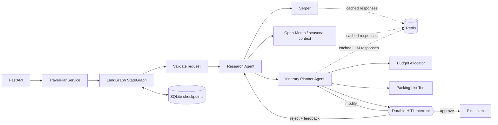

# AI Travel Planner

A complete take-home implementation of a multi-agent travel planning service built with
Python, LangGraph, and FastAPI. A research agent gathers destination intelligence, an itinerary
agent creates a budget-aware day-by-day plan, and the workflow pauses durably until a person
approves, rejects, or modifies the draft.

The service runs without paid credentials in `demo` mode. In `live` mode it uses Serper for
current web research, Open-Meteo for forecast context, and optionally the OpenAI Responses API
for schema-constrained research synthesis and itinerary generation.

## Architecture



Every plan ID is also a LangGraph `thread_id`. LangGraph checkpoints the state in SQLite before
the review interrupt, so a plan can be resumed after an application restart. The API does not
expose a final plan until the approval branch has completed.

## Features

- FastAPI endpoints for creation, status, HITL review, and final retrieval
- Real LangGraph `interrupt()` and `Command(resume=...)` lifecycle
- SQLite-backed checkpoint persistence across process restarts
- Separate research and itinerary agents with two tools each
- Serper search with normalized source records
- Open-Meteo geocoding and forecast context without an API key
- Optional OpenAI schema-constrained generation
- Redis caching for successful Serper, Open-Meteo, and identical OpenAI requests
- Credential-free, deterministic demo mode for local evaluation
- Approve, reject-with-feedback, and targeted modification paths
- Strict input and generated-plan validation, meaningful 404/409/422/502 responses, and revision
  limits
- Docker support and an executable API demo script

## Quick start

### 1. Create a virtual environment

Python 3.11 through 3.13 is supported.

```bash
cd ai-travel-planner
python3.12 -m venv .venv
source .venv/bin/activate
python -m pip install -e .
```

Install the optional development dependency when you want to run Ruff:

```bash
python -m pip install -e '.[dev]'
```

### 2. Configure the application

Demo mode needs no secrets:

```bash
cp .env.example .env
```

The example enables Redis caching. Start Redis with Docker before running the API:

```bash
docker compose up -d redis
```

If Redis is not available, clear `REDIS_URL`; provider calls will continue without caching.

To use current web research, set `APP_MODE=live` and configure Serper:

```dotenv
APP_MODE=live
SERPER_API_KEY=your_serper_key
```

LLM generation is optional. The agent/tool workflow still runs deterministically without it. To
enable OpenAI:

```dotenv
LLM_PROVIDER=openai
OPENAI_API_KEY=your_openai_key
OPENAI_MODEL=gpt-5-mini
```

### 3. Run the API

```bash
uvicorn app.main:app --reload
```

Open:

- Swagger UI: <http://127.0.0.1:8000/docs>
- OpenAPI JSON: <http://127.0.0.1:8000/openapi.json>
- Health check: <http://127.0.0.1:8000/health>

## API workflow

### Create a plan

```bash
curl -sS -X POST http://127.0.0.1:8000/plan \
  -H 'Content-Type: application/json' \
  -d '{
    "current_location": "Bengaluru, India",
    "destination": "Kyoto, Japan",
    "start_date": "2026-11-10",
    "end_date": "2026-11-12",
    "budget_min": 1800,
    "budget_max": 2600,
    "origin_transport_budget": 600,
    "currency": "USD",
    "interests": ["temples", "food", "photography"],
    "travelers": 2,
    "preferences": ["vegetarian-friendly", "public transport"]
  }'
```

The call executes research and planning synchronously, stops at the durable review interrupt, and
returns HTTP `201` with a `plan_id`, status URL, and review URL.

`origin_transport_budget` is the user-provided estimated round-trip cost from the current location
to the destination for all travelers. It is included in the total budget and deducted before the
remaining amount is allocated across lodging (35%), food (20%), activities (25%), local transport
(15%), and contingency (5%).

### Inspect the draft and workflow status

```bash
curl -sS http://127.0.0.1:8000/plan/PLAN_ID
```

The response includes the validated request, research report, draft itinerary, review history,
revision count, and `awaiting_input`. Before approval, the status is `awaiting_review`.

### Approve

```bash
curl -sS -X POST http://127.0.0.1:8000/plan/PLAN_ID/review \
  -H 'Content-Type: application/json' \
  -d '{"action":"approve","feedback":"Ready to finalize."}'
```

### Reject with feedback

Rejection routes back through research and itinerary generation, then pauses on a new review.

```bash
curl -sS -X POST http://127.0.0.1:8000/plan/PLAN_ID/review \
  -H 'Content-Type: application/json' \
  -d '{
    "action":"reject",
    "feedback":"Add stronger late-evening transit safety research."
  }'
```

### Modify selected plan details

Modification routes directly back to the itinerary agent and supports hotel and per-day changes.
Each referenced day must exist in the trip, and duplicate or blank changes are rejected.

```bash
curl -sS -X POST http://127.0.0.1:8000/plan/PLAN_ID/review \
  -H 'Content-Type: application/json' \
  -d '{
    "action":"modify",
    "feedback":"Make day two slower.",
    "modifications": {
      "hotel_preference":"Prefer a quiet hotel near Kyoto Station.",
      "day_changes":[{
        "day":2,
        "replace_activities_with":["Tea ceremony","Riverside walk"],
        "note":"Keep the afternoon low-key."
      }]
    }
  }'
```

### Review rules

- `approve` accepts optional feedback but must not include `modifications`.
- `reject` requires feedback and must not include `modifications`.
- `modify` requires a `modifications` object containing a hotel preference, day changes, or both.
- A review is accepted only while the plan is `awaiting_review`. Approval finalizes and freezes the
  plan; create a new plan if changes are needed afterward.

Swagger UI provides separate `approve`, `reject`, and `modify` examples. Choose the matching
example before submitting the review request.

### Retrieve the final plan

```bash
curl -sS http://127.0.0.1:8000/plan/PLAN_ID/final
```

This endpoint returns HTTP `409` until the plan is approved. After approval it returns the frozen
itinerary, budget including origin transport, packing list, assumptions, plan ID, and finalization
timestamp.

## Endpoints

| Method | Endpoint | Result |
|---|---|---|
| `GET` | `/health` | Liveness and configured mode |
| `POST` | `/plan` | Create a plan and execute through the first review pause |
| `GET` | `/plan/{id}` | Current checkpointed state and draft |
| `POST` | `/plan/{id}/review` | Resume with approve, reject, or modify |
| `GET` | `/plan/{id}/final` | Finalized plan after approval only |

## Configuration

| Variable | Default | Meaning |
|---|---:|---|
| `APP_MODE` | `demo` | `demo` uses labeled sample data; `live` calls Serper and Open-Meteo |
| `DATABASE_PATH` | `data/travel_planner.sqlite3` | Durable LangGraph SQLite checkpoint file |
| `SERPER_API_KEY` | empty | Serper credential |
| `LLM_PROVIDER` | `deterministic` | `deterministic` or `openai` |
| `OPENAI_API_KEY` | empty | OpenAI credential |
| `OPENAI_MODEL` | `gpt-5-mini` | Responses API model name |
| `OPENAI_TIMEOUT_SECONDS` | `120` | Read timeout for OpenAI generation |
| `HTTP_TIMEOUT_SECONDS` | `20` | Timeout for search, weather, and connections |
| `REDIS_URL` | empty | Redis connection URL; for example `redis://localhost:6379/0` |
| `CACHE_TTL_SECONDS` | `900` | Redis lifetime for successful provider responses; `0` disables caching |
| `MAX_REVISIONS` | `5` | Maximum reject/modify cycles; approval remains available |

`APP_MODE=live` fails clearly if the Serper key is unavailable. Open-Meteo forecasts
are used only when the requested start date is inside its short forecast window; otherwise the
response is explicitly labeled as a seasonal estimate.

Cache entries use hashed keys and contain only successful results. Exact repeated live searches,
live weather requests, and OpenAI structured-generation requests are reused until the TTL expires.
Redis errors are logged and bypassed, so a cache outage does not fail plan creation.

## Check code quality

```bash
ruff check .
```

## Run the demo script

With the API running in another terminal:

```bash
python scripts/demo.py
```

It creates a three-day plan, reads the draft, approves it, and retrieves the final plan.

## Docker

After configuring `.env` as described above:

```bash
docker compose up --build
```

Docker Compose starts the API and Redis together. The `data/` bind mount preserves SQLite
checkpoints, and the `redis-data` volume preserves cached entries until their TTL expires.

## Design decisions and tradeoffs

- **Synchronous plan creation:** `POST /plan` returns only after research/planning reaches review.
  This is simple and deterministic for a take-home. For long provider calls, production should
  return `202 Accepted` and run the graph through a worker queue.
- **SQLite checkpointer:** ideal for local evaluation and proves durable HITL semantics. A
  multi-instance deployment should use PostgreSQL or another supported network checkpointer.
- **Deterministic fallback:** reviewers can exercise every path without keys or API charges. It is
  also used when LLM output fails date, budget, or structural consistency checks. All demo sources
  and estimates are labeled; live claims are not silently fabricated.
- **Redis TTL cache:** exact successful provider responses are shared across app processes to
  reduce latency, rate-limit usage, and LLM cost. Cache access fails open, and hashed keys avoid
  placing raw queries or prompts in Redis key names.
- **Small modification contract:** hotel and per-day edits are auditable and easy to validate.
- **Research on reject, planning on modify:** rejection can invalidate evidence, so it repeats both
  agents. A targeted modification normally preserves research and only reruns planning.
- **No booking side effects:** the system generates planning recommendations only. Activities,
  prices, safety advice, and operating details must be confirmed before purchase.

## Recommended Improvements

### 1. Background processing

Move research and itinerary generation to a background worker. `POST /plan` could return
`202 Accepted` immediately, while `GET /plan/{id}` reports progress. BullMQ could be used with a
separate Node.js worker, or a Python-native queue such as Celery, RQ, or ARQ could be used.

### 2. Production database

Replace local SQLite with PostgreSQL so multiple application instances can safely share workflow
checkpoints and plan data.

### 3. Authentication and ownership

Add token-based authentication and associate every plan with a user. Users should only be able to
read or modify plans that they own.

### 4. External API reliability

Add retries, exponential backoff, rate limiting, and fallback providers for web search, weather,
and LLM calls.

### 5. Prompt validation

Detect and handle personally identifiable information, sanitize input before inserting it into a
prompt or sending it to an LLM, defend against prompt-injection attempts, and add guardrails around
tool selection and execution.

### 6. Research quality and citations

Prioritize official tourism and travel-advisory sources. Store source dates and attach citations to
important claims such as safety guidance, prices, and opening hours.

### 7. Additional travel tools

Add flight estimates, hotel availability, live currency conversion, restaurant search, and more
accurate transport-time calculations.

### 8. User interface

Build a small web interface for entering preferences, viewing the itinerary, changing a specific
day, and approving or rejecting a plan without using Swagger UI.

### 9. Monitoring and cost visibility

Add structured logs, distributed tracing, performance metrics, alerts, provider-latency tracking,
LLM token-cost monitoring, cache hit/miss metrics, and cache-stampede protection.

### 10. Safe concurrent review

Add database-backed plan versions and concurrency checks across multiple application instances so
two reviewers cannot accidentally resume or overwrite the same workflow checkpoint.

### 11. Automated testing

Add validation and tool unit tests, endpoint tests, approve/reject/modify workflow tests,
restart-persistence tests, provider contract tests, and load tests.

### 12. Security and privacy

Store credentials in a secrets manager, encrypt sensitive trip information, redact personal data
from logs, and define retention and deletion policies.

### 13. Itinerary quality evaluation

Extend the current date, activity-budget, and source checks to verify realistic travel times,
activity duration and overlap, opening hours, and deeper preference satisfaction.

## Assumptions

- A trip is between 1 and 21 calendar days and has 1-20 travelers.
- `current_location` is the traveler origin used for research and planning context; provide a
  city/region and country rather than a street address.
- The supplied budget includes the user-provided origin transport estimate plus lodging, food,
  activities, local transport, and contingency at the destination.
- Origin transport is a planning estimate supplied by the user, not a live fare or confirmed quote.
- Currency conversion and booking are outside scope.
- Search results are research inputs rather than guarantees; the plan carries verification notes.
- One reviewer acts on a plan at a time in this local implementation.
